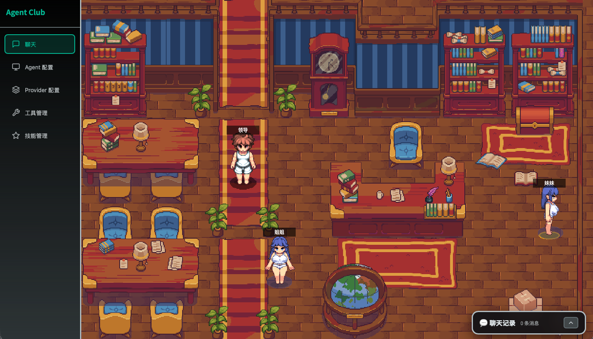
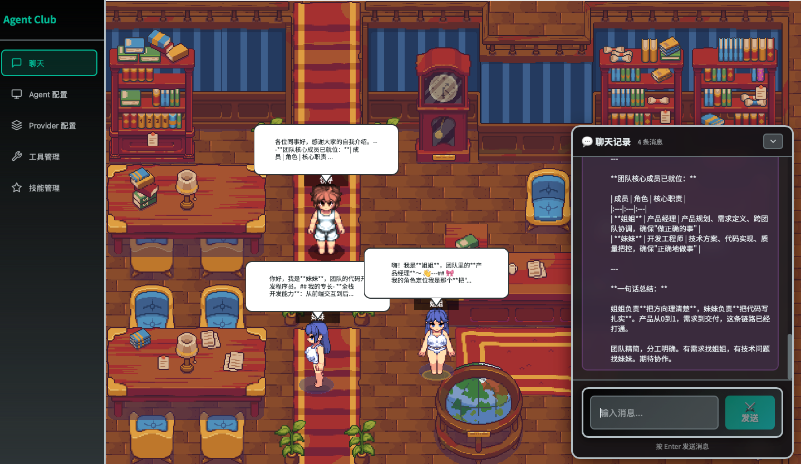

# 🤖 RPG Multi-Agent System

> ⚠️ **早期开发阶段** | 🚧 **持续开发中** | 📝 **API 可能变动**

一个基于 **RPG 像素风格** 的多 Agent 协作对话系统，支持 Manager-Worker 架构




---

## ✨ 核心特性

### 🎮 RPG 像素风界面
- **2D 游戏场景**：基于 Phaser.js 的星露谷物语风格办公室场景
- **Agent 形象**：Manager 与 Worker 均使用帧动画精灵图（四方向行走/待机动画）
- **动画状态**：待机 / 行走 / 思考 / 说话
- **对话气泡**：游戏风格的对话展示
- **点击移动**：选中角色后点击地图空地可移动，自动避障

### 🧠 多 Agent 架构
- **Manager-Worker 模式**：智能任务分派与结果整合
- **MsgHub 模式**：传统多 Agent 广播对话
- **独立模型配置**：每个 Agent 可配置不同的 LLM Provider

### 🔧 支持的模型提供商
| 提供商 | 状态 | 备注 |
|--------|------|------|
| DashScope (阿里云) | ✅ 已支持 | qwen 系列 |
| OpenAI | ✅ 已支持 | GPT 系列 |
| Anthropic | ✅ 已支持 | Claude 系列 |
| Kimi (Moonshot) | ✅ 已支持 | kimi 系列 |
| 自定义 Provider | ✅ 已支持 | 任意兼容 OpenAI API 的服务 |

### 🛠️ 技能系统
- **内置技能**：文件操作、浏览器自动化
- **技能管理**：通过 Skill 面板启用/禁用技能
- **可扩展**：支持自定义技能注册，自动加载 `agents/skills/` 目录下的技能文件
- **技能绑定**：每个 Agent 可独立配置启用的技能列表

### 🧰 工具系统
- 内置工具：文件操作、浏览器自动化
- 可扩展：支持自定义工具注册

---

## 🏗️ 项目架构

```
┌─────────────────────────────────────────────────────────┐
│                    前端 (React + Phaser)                 │
│  ┌─────────────────────────────────────────────────┐   │
│  │  Phaser 游戏场景                                  │   │
│  │  - ChatScene.ts (像素风办公室)                   │   │
│  │  - Agent 角色 (Manager/Worker)                   │   │
│  │  - 动画系统 (idle/thinking/speaking)             │   │
│  └─────────────────────────────────────────────────┘   │
│                         ↑↓                              │
│  ┌─────────────────────────────────────────────────┐   │
│  │  React UI 组件                                   │   │
│  │  - 侧边栏导航                                    │   │
│  │  - 浮动聊天窗口                                  │   │
│  │  - Agent 配置面板                                │   │
│  │  - Provider 配置面板                             │   │
│  └─────────────────────────────────────────────────┘   │
└─────────────────────────────────────────────────────────┘
                            ↑↓ HTTP
┌─────────────────────────────────────────────────────────┐
│                   后端 (FastAPI)                         │
│  ┌─────────────┐  ┌─────────────┐  ┌─────────────────┐ │
│  │  Chat API   │  │ Agent API   │  │  Provider API   │ │
│  │  /api/chat  │  │ /api/agents │  │ /api/providers  │ │
│  └─────────────┘  └─────────────┘  └─────────────────┘ │
│  ┌─────────────┐  ┌─────────────┐  ┌─────────────────┐ │
│  │ManagerAgent │  │ WorkerAgent │  │   ChatAgent     │ │
│  │  (任务协调)  │  │  (任务执行)  │  │  (普通对话)      │ │
│  └─────────────┘  └─────────────┘  └─────────────────┘ │
└─────────────────────────────────────────────────────────┘
                            ↑↓
┌─────────────────────────────────────────────────────────┐
│              基础设施层                                   │
│  ┌─────────────┐  ┌─────────────┐  ┌─────────────────┐ │
│  │   Qdrant    │  │   配置文件   │  │    工具系统      │ │
│  │  向量数据库  │  │  (JSON)     │  │  (内置+扩展)     │ │
│  └─────────────┘  └─────────────┘  └─────────────────┘ │
└─────────────────────────────────────────────────────────┘
```

---

## 🚀 快速开始

### 环境要求
- Python 3.10+
- Node.js 18+
- Qdrant (向量数据库，可选 Docker)

### 1. 安装依赖

```bash
# 后端依赖
pip install -r requirements.txt

# 前端依赖
cd rpg-frontend
npm install
cd ..
```

### 2. 配置环境变量

```bash
cp .env.example .env
# 编辑 .env 文件，配置 API 密钥
```

### 3. 启动服务

**开发模式**（推荐）：
```bash
# 终端 1: 启动后端（开发模式，带热重载）
python main.py --dev

# 终端 2: 启动前端（独立开发服务器）
cd rpg-frontend
npm run dev
```

**生产模式**：
```bash
# 单命令启动（自动构建前端）
python main.py
```

### 4. 访问应用

- 前端界面：http://localhost:5173 （开发模式）或 http://localhost:8000 （生产模式）
- API 文档：http://localhost:8000/docs

---

## 📁 项目结构

```
.
├── agents/                 # Agent 实现
│   ├── manager_agent.py   # Manager 智能体（任务协调）
│   ├── chat_agent.py      # 基础对话智能体
│   └── __init__.py
├── api/                   # FastAPI 接口
│   ├── api_server.py      # 主服务入口
│   ├── agents_api.py      # Agent 配置接口
│   ├── providers_api.py   # Provider 配置接口
│   └── ...
├── config/                # 配置管理
│   ├── agents_config.py   # Agent 配置
│   ├── manager_config.py  # Manager 配置
│   └── ...
├── providers/             # LLM 提供商管理
│   ├── provider_manager.py
│   ├── dashscope_provider.py
│   ├── anthropic_provider.py
│   └── ...
├── tools/                 # 工具系统
│   ├── builtin/           # 内置工具
│   └── extensions/        # 扩展工具
├── rag_knowledge_base/    # RAG 知识库
├── rpg-frontend/          # 前端项目
│   ├── src/
│   │   ├── game/          # Phaser 游戏场景
│   │   │   └── ChatScene.ts
│   │   ├── components/    # React 组件
│   │   ├── pages/         # 页面组件
│   │   └── ...
│   ├── public/
│   │   └── assets/
│   │       ├── characters/  # 角色帧动画精灵图
│   │       └── maps/        # Tiled 地图资源
│   └── package.json
├── data/                  # 数据存储
├── main.py               # 主入口
└── requirements.txt      # Python 依赖
```

---

## ⚙️ 配置说明

### 创建 Agent

1. 进入 **"Provider 配置"** 页面，添加 LLM 提供商（如 DashScope、OpenAI）
2. 进入 **"Agent 配置"** 页面，创建 Worker Agent
3. 可选：在 **"Manager 配置"** 中启用 Manager 模式

### Manager-Worker 模式

启用后：
- Manager 分析用户请求，拆解为子任务
- 分派给合适的 Worker 执行
- 收集结果并整合回复

不启用时：
- 使用传统 MsgHub 模式
- 所有 Agent 同时收到消息并独立回复

---

## 🔌 API 端点

| 端点 | 方法 | 描述 |
|------|------|------|
| `/api/chat` | POST | 发送消息，获取 Agent 响应 |
| `/api/agents` | GET | 获取所有 Agent 列表 |
| `/api/agents` | POST | 创建新 Agent |
| `/api/providers` | GET | 获取所有 Provider 列表 |
| `/api/providers` | POST | 创建新 Provider |
| `/api/system/reinitialize` | POST | 重新初始化系统 |
| `/api/health` | GET | 健康检查 |


本项目处于早期开发阶段，API 和架构可能随时调整。欢迎提交 Issue 和 PR！

---

## 📄 许可证

MIT License

---

## 🙏 致谢

- [AgentScope](https://github.com/modelscope/agentscope) - 多 Agent 框架参考
- [Phaser](https://phaser.io/) - 2D 游戏引擎
- [FastAPI](https://fastapi.tiangolo.com/) - 现代 Python Web 框架

---

> 🎮 **提示**：这是一个实验性项目，旨在探索多 Agent 协作的可视化交互方式。欢迎在 [Issues](../../issues) 中分享你的想法和建议！
